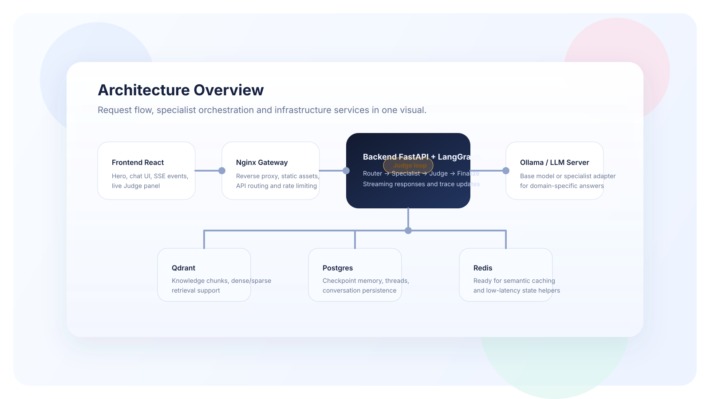

# Multi-Agent Chatbot

A context-aware chatbot that routes each query to a domain-specialized agent, optionally grounds the answer in a domain knowledge base (RAG), and gates the response through an LLM-as-a-judge before it reaches the user.

> **Status: experimental / work in progress.** The orchestration graph, routing, and RAG pipeline are functional end-to-end, but several pieces advertised in the UI (per-domain fine-tuned models, the reflection/retry loop, semantic caching) are wired into the config and code paths without being active by default. See [Current status](#current-status-working-vs-present-but-inactive) below for the honest breakdown.

## Overview

The goal of this project is a chatbot backed by *multiple specialized agents* rather than one generic model with one giant prompt: each domain (cryptography & post-quantum, eIDAS2/compliance, software engineering, or a general fallback) is meant to be served by a model tuned specifically for it, selected automatically based on the content of the user's question.

What makes this "multi-agent" in practice is not prompt-chaining — it's a real [LangGraph](https://github.com/langchain-ai/langgraph) state machine with distinct nodes for routing, answering, and quality-checking, each of which can succeed, fail, or trigger a different path through the graph. A companion [QLoRA fine-tuning pipeline](training/README.md) exists to actually produce the per-domain specialist models that the router dispatches to.

## Architecture



> The diagram above (a static SVG rendered in the frontend's home page) currently shows a **single** backend instance. An earlier iteration of this diagram (built with Mermaid.js, since removed — see git history at commit `959f4c9`) explicitly showed **two backend instances** behind the gateway to illustrate horizontal scaling. That capability is not deployed today — see the [scaling roadmap](#known-limitations--scaling-roadmap) below.

**Components:**

| Component | Role |
|---|---|
| **Gateway** (Nginx, `infra/nginx/`) | Single public entry point (`:80`). Reverse-proxies to the frontend and backend, rate-limits `/api/` (40 r/s, burst 120), and is specifically tuned for SSE streaming on `/api/v1/chat/stream` (buffering off, 3600s read timeout). |
| **Frontend** (React 18 + Vite, `frontend/`) | Single-page app, split into a thin `App.jsx` shell, `pages/` (home, chat), a `components/` judge panel, a `useChatSession` hook, and a small `lib/` for API calls and SSE parsing. Consumes the backend's SSE stream via a hand-rolled `fetch` + `ReadableStream` reader (not the native `EventSource`, since it needs POST with a JSON body). |
| **Backend** (FastAPI + LangGraph, `backend/`) | Hosts the agent graph and the HTTP/SSE API. Builds one graph instance per process at startup (`backend/app/main.py`). |
| **Qdrant** | Vector store for RAG, one collection per domain that needs it. |
| **Postgres** | Backs LangGraph's checkpointer, so conversation state lives outside the process — a real strength for stateless, horizontally-scalable API replicas. |
| **Redis** | Provisioned in Compose and referenced in config as a semantic-cache layer, but **not currently used by any backend code** — see [Current status](#current-status-working-vs-present-but-inactive). |

**Request flow** (`POST /api/v1/chat/stream`):

```
client → gateway (nginx) → backend /api/v1/chat/stream (SSE)
  → preprocess   (normalize input, detect language, reset retry count)
  → router       (embedding-centroid similarity per domain → LLM zero-shot fallback → keyword fallback)
  → specialist   (calls the domain's model, optionally with RAG context from Qdrant)
  → judge        (LLM-as-a-judge scores faithfulness / relevance / completeness / safety)
  → retry to specialist (if judge failed AND retries remain)  |  finalize (otherwise)
  → typed SSE events streamed back: route, specialist, judge_status, judge, answer, done
```

A synchronous twin endpoint (`POST /api/v1/chat`) runs the same graph via `ainvoke` without streaming, mainly for the eval harness and tests.

## Tech stack

| Layer | Technology |
|---|---|
| Frontend | React 18.3, Vite 5.4, ESLint 9 + Prettier |
| Backend framework | Python 3.11, FastAPI ≥0.111, `sse-starlette` (SSE), Pydantic v2 |
| Agent orchestration | LangGraph ≥0.2, `langgraph-checkpoint-postgres`, `langchain-core` (message types) |
| LLM / embeddings | OpenAI-compatible client (`openai` SDK) pointed at a self-hosted server — **Ollama** in dev (`qwen2.5:7b-instruct`, `bge-m3`), **vLLM** intended for production (base model + LoRA adapters selected by model name) |
| RAG | Qdrant (`qdrant-client`), hybrid dense + BM25 retrieval fused with Reciprocal Rank Fusion, optional cross-encoder rerank (disabled by default) |
| Persistence | Postgres 16 via `AsyncPostgresSaver` (conversation checkpoints) |
| Cache | Redis 7 (provisioned, not wired into any code path yet) |
| Gateway | Nginx (reverse proxy, rate limiting, SSE-aware) |
| Containerization | Docker, Docker Compose |
| Fine-tuning | QLoRA / PEFT / TRL / bitsandbytes, exported via `llama.cpp` to GGUF and loaded through Ollama Modelfiles — see [`training/README.md`](training/README.md) |

## Repository structure

```
Multi_Agent_Chatbot/
├── docker-compose.yml       # backend, frontend, gateway, qdrant, postgres, redis
├── backend/
│   ├── app/
│   │   ├── agents/           # LangGraph graph, node implementations, domain registry, prompts
│   │   │   └── nodes/          # preprocess, router, specialist, judge, finalize
│   │   ├── api/v1/            # FastAPI routers: chat, agents, evaluation
│   │   ├── core/               # settings (config.py), checkpointer factory
│   │   ├── llm/                  # OpenAI-compatible chat/embedding clients
│   │   ├── rag/                   # Qdrant store, hybrid retriever, offline ingest CLI
│   │   ├── eval/                   # small hardcoded eval harness
│   │   └── schemas/                 # request/response pydantic models
│   ├── knowledge/crypto/               # source docs for the kb_crypto collection
│   ├── Dockerfile, pyproject.toml, .env.example
├── frontend/
│   ├── src/
│   │   ├── App.jsx             # top-level screen switch (home vs. chat)
│   │   ├── pages/               # HomePage, ChatScreen
│   │   ├── components/           # JudgePanel
│   │   ├── hooks/                 # useChatSession (message state + SSE handling)
│   │   └── lib/                    # api.js (fetch/SSE), content.js (static copy/data)
│   ├── public/architecture-overview.svg
│   ├── eslint.config.js, .prettierrc.json
│   └── Dockerfile, nginx.frontend.conf
├── infra/nginx/               # gateway Dockerfile + nginx.conf
└── training/                   # QLoRA fine-tuning pipeline for per-domain adapters (see its own README)
```

## Setup / quickstart

**Prerequisites:**

- Docker + Docker Compose
- [Ollama](https://ollama.com) running on the **host** machine (the backend container talks to it at `http://host.docker.internal:11434`), with these models pulled:
  - `qwen2.5:7b-instruct` (base chat model)
  - `bge-m3` (embeddings)

**Run everything:**

```bash
cp backend/.env.example backend/.env   # adjust if needed — see note below
docker compose up --build
```

The app is served entirely through the gateway at `http://localhost` (only the `gateway` service publishes a host port in Compose; `backend`/`frontend` are internal-only).

**Local (non-Docker) development**, for faster iteration on one side at a time:

```bash
# backend
cd backend && pip install -e ".[dev]"
uvicorn app.main:app --reload

# frontend
cd frontend && npm install && npm run dev
```

The frontend has `npm run lint` (ESLint) and `npm run format` / `npm run format:check` (Prettier) — run them before committing frontend changes.

**Key environment variables** (`backend/.env`, see `backend/app/core/config.py` for the full list):

| Variable | Purpose |
|---|---|
| `LLM_BASE_URL`, `LLM_API_KEY`, `LLM_BASE_MODEL` | OpenAI-compatible chat endpoint (Ollama locally, vLLM in prod) |
| `EMBED_BASE_URL`, `EMBED_API_KEY`, `EMBED_MODEL`, `EMBED_DIM` | Embedding endpoint (bge-m3, 1024-dim) |
| `USE_ADAPTERS` | `False` (default): every domain uses the base model. `True`: specialists use their LoRA adapter name from the registry. |
| `QDRANT_URL`, `REDIS_URL`, `POSTGRES_DSN` | Infra connection strings |
| `CORS_ORIGINS` | Allowed frontend origins |

> **Note:** `backend/.env.example` only documents the variables above. `config.py` defines several more tunables that currently have no `.env.example` entry: `ROUTER_CONFIDENCE_THRESHOLD` (0.55), `JUDGE_PASS_THRESHOLD` (3.5), `MAX_REFLECTION_RETRIES` (0), `SPECIALIST_TEMPERATURE`, `JUDGE_TEMPERATURE`, `MAX_TOKENS`, RAG's `RAG_TOP_K`/`RAG_FETCH_K`/`RERANK_ENABLED`, and request timeouts. They all have working defaults, but a new contributor has to read the source to discover them — see the roadmap below.

## Current status: working vs. present-but-inactive

| Working today | Present but inactive |
|---|---|
| Embedding-centroid routing with LLM and keyword fallbacks | **Per-domain LoRA adapters** — the training pipeline is complete, but `USE_ADAPTERS=False` by default, so all four domains currently answer with the same base model, differentiated only by system prompt |
| Hybrid dense+BM25 RAG retrieval on the `kb_crypto` collection | **Reflection/retry loop** — `MAX_REFLECTION_RETRIES=0` by default, so the judge only *scores* answers, it never triggers a regeneration, despite the frontend UI prominently displaying it as a feature |
| SSE streaming of routing/answer/judge events to the frontend | **`kb_eidas` collection** — registered in the domain registry, but never ingested, so the `eidas_compliance` domain silently gets zero RAG context |
| Postgres-backed conversation persistence (stateless API layer) | **Redis** — provisioned in Compose and referenced in config, but not imported or called anywhere in `backend/app/` |
| Judge scoring with a safe neutral fallback on parse/call failure | — |

## Known limitations & scaling roadmap

This is an analysis of gaps found while reviewing the codebase and infrastructure — **not yet implemented**. Each row is a reasonable candidate for a tracked issue.

| Area | Gap | Recommendation | Priority |
|---|---|---|---|
| Backend scaling | Nginx's `backend_pool`/`frontend_pool` upstreams are pre-wired with keepalive pooling, but each has exactly one `server` entry in Compose — no real load balancing is deployed despite the UI copy claiming it | Run multiple backend replicas and add them to the upstream (or use Compose `--scale` + DNS-based upstream, or move to an orchestrator with native scaling) | High |
| Secrets management | Postgres credentials (`chat`/`chat_pw`) are hardcoded directly in `docker-compose.yml` | Move to `.env`/Docker secrets, never commit credentials | High |
| Network exposure | Qdrant (6333/6334), Postgres (5432), and Redis (6379) are all published directly to the host | Drop `ports:` for internal-only services; only `gateway` should be host-exposed | High |
| Authentication | No auth/authorization on any FastAPI endpoint | Add at least API-key or JWT auth before any non-local deployment | High |
| Health & restart behavior | Only `postgres` has a Docker healthcheck; `backend`/`frontend`/`gateway`/`qdrant`/`redis` don't, so `depends_on` can't distinguish "started" from "ready" | Add healthchecks to all services and use `condition: service_healthy` throughout | High |
| Test coverage | Zero automated tests exist, despite `pytest`, `pytest-asyncio`, `ruff`, and `mypy --strict` being declared as dev dependencies | Add unit tests for router logic, judge JSON parsing, and RAG fusion; wire into CI | High |
| RAG consistency | `QdrantStore` silently falls back to a per-process local on-disk Qdrant if the remote is unreachable, with no alerting — risks divergent, unshared state across replicas | Make the fallback loud (metric/log/alert) or remove it in favor of failing fast | High |
| Repo hygiene | `backend/.qdrant/` (local Qdrant fallback data, including sqlite files) is accidentally tracked in git — the monorepo's `.gitignore` only excludes `qdrant_storage/`, not `.qdrant/` | Add `.qdrant/` to `.gitignore` and untrack the accidentally-committed files | High |
| Transport security | Gateway only listens on port 80, no TLS | Terminate TLS at the gateway (or a proxy in front of it) | Medium |
| Observability | No metrics or centralized logging — only container stdout and basic nginx logs | Add a metrics/logging stack (e.g. Prometheus + Grafana, structured JSON logs) | Medium |
| CI/CD | No pipeline exists (no `.github/workflows`) despite lint/type/test tooling already being declared | Add a CI workflow running `ruff`, `mypy`, and `pytest` on every push/PR | Medium |
| RAG completeness | `kb_eidas` is referenced by the registry but has never been ingested | Ingest the eIDAS knowledge base, or disable that domain's `use_rag` until it is | Medium |
| RAG performance | BM25 index is built by scrolling the *entire* Qdrant collection into memory, cached for the process lifetime with no invalidation on new ingests | Invalidate/rebuild the cache on ingest, or move to a persistent/shared sparse index | Medium |
| Caching | Redis is provisioned and referenced in config/UI copy as "semantic cache" but wired into no code path | Implement real semantic caching, or remove the unused service and the UI claim | Medium |
| Model specialization | LoRA adapters aren't trained/deployed; all domains share one base model | Run the `training/` pipeline for each domain and flip `USE_ADAPTERS=True` | Medium |
| Config discoverability | `.env.example` documents fewer variables than `config.py` actually defines | Sync `.env.example` with the full settings surface (router/judge thresholds, RAG params, timeouts) | Medium |
| RAG operability | Ingestion is CLI-only (`python -m app.rag.ingest`), not exposed via API | Add an authenticated ingestion endpoint for adding documents without a redeploy/shell access | Low |
| Reflection loop | `MAX_REFLECTION_RETRIES=0` by default, so retries never fire even though the UI advertises the feature | Either default it on, or make the UI reflect the actual default behavior | Low |
| Container hardening | Backend runs as root, no multi-stage build (frontend already has a `.dockerignore` and a multi-stage build) | Add a non-root `USER` and a multi-stage build to the backend `Dockerfile` | Low |
| Resource limits | No CPU/memory limits configured for any service | Add `deploy.resources.limits` per service to avoid noisy-neighbor effects | Low |
| Streaming error handling | No structured `error` SSE event exists — if the graph raises mid-stream, the frontend only sees a generic fetch-level failure | Add a typed `error` event to the SSE protocol and handle it explicitly in the frontend | Low |

Out of scope for this pass, but worth a follow-up: the monorepo's top-level `README.md` (`AgenticAI/README.md`) predates this project and doesn't list it among the repo's prototypes.
